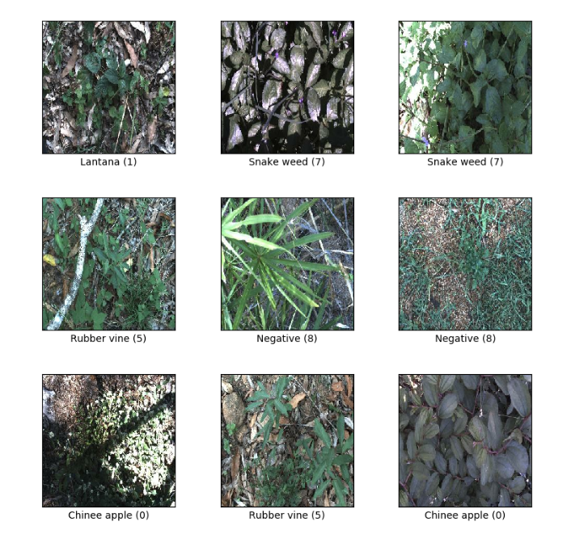
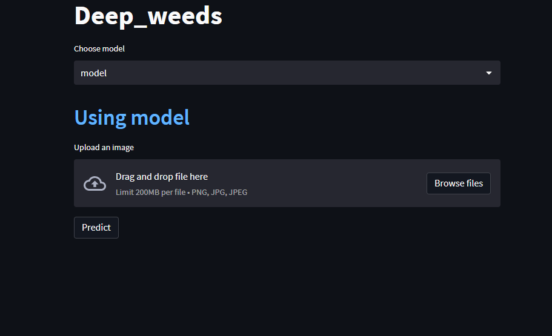
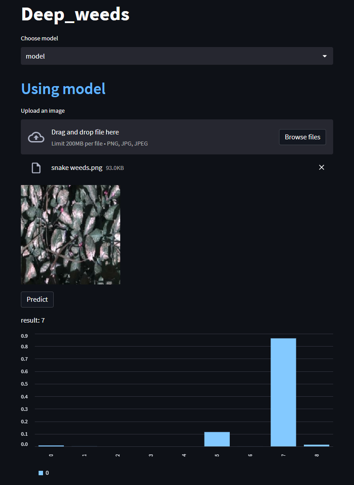
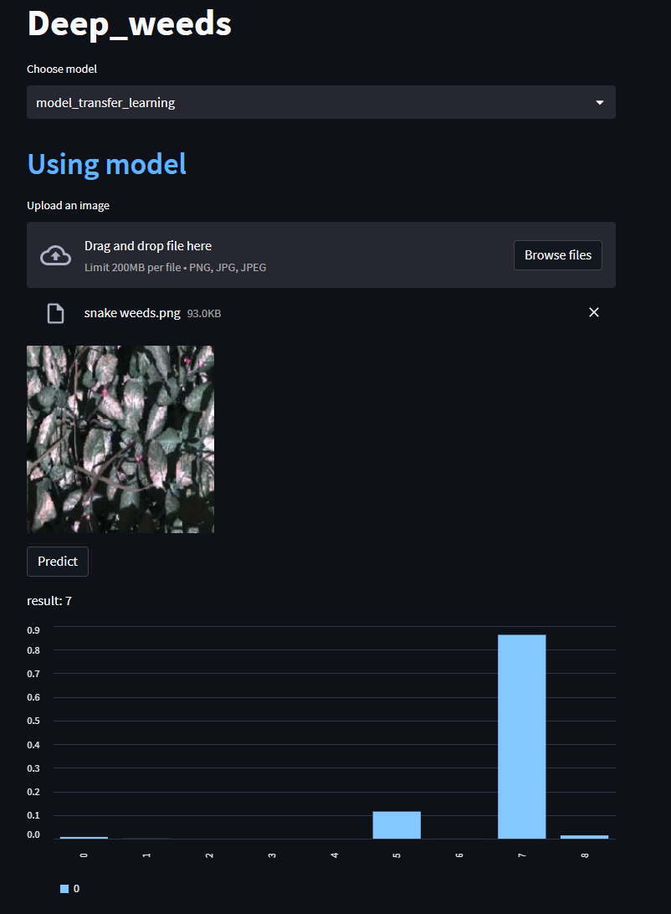

# deep_weeds
The [DeepWeeds](https://www.tensorflow.org/datasets/catalog/deep_weeds) dataset consists of 17,509 images capturing eight different weed species native to Australia in situ with neighbouring flora.The selected weed species are local to pastoral grasslands across the state of Queensland.The images were collected from weed infestations at the following sites across Queensland: "Black River", "Charters Towers", "Cluden", "Douglas", "Hervey Range", "Kelso", "McKinlay" and "Paluma".

Dataset size: 469.99 MiB

FeaturesDict({
    'image': Image(shape=(256, 256, 3), dtype=uint8), \
     'label': ClassLabel(shape=(), dtype=int64, num_classes=9), \
}) \

## Clone recursively
``` shell
git clone https://github.com/yahyoxonqwe/deep_weeds.git
```
## Enter this file
``` shell
cd deep_weeds
```
## Install Virtual environment
To use the deep_weeds dataset, it is recommended to create a virtual environment in Python. You can do this by using the virtualenv package. First, install virtualenv using pip:
``` shell
python -m pip install --user virtualenv
```
## give a name this environment
``` shell
python -m venv your_env
```
## Activate this environment
``` shell
your_env\Scripts\activate.bat
```
## Install requirements
``` shell
pip install -r requirement.txt
```
## Open jupyter notebook
``` shell
jupyter notebook
```
## Run streamlit
``` shell
streamlit run streamlit.py
```


## Predict


## Predict with transfer_learning



